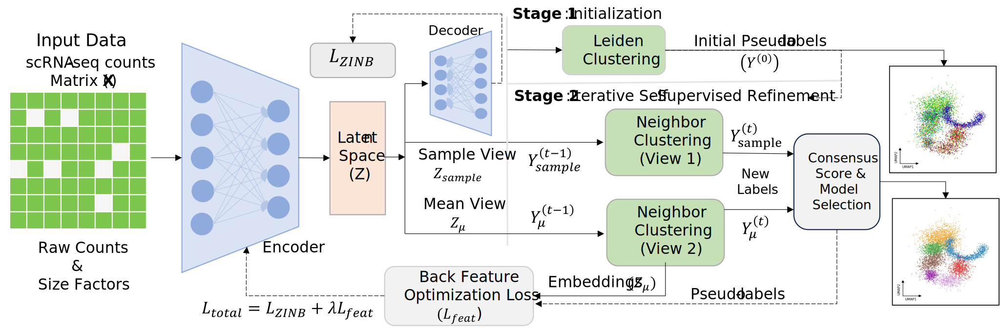

# scDMC

---

## Introduction

Single-cell RNA sequencing (scRNA-seq) clustering is challenging due to high noise, sparsity, and the often unknown number of cell clusters ($K$). Existing deep clustering methods typically require a pre-specified $K$, limiting their use in exploratory analysis.

**scDMC** is a fully automatic deep clustering framework that formulates clustering as a joint representation–structure–model selection problem.

   1. **Noise-Robust Embedding**  
   Uses a ZINB-based autoencoder to handle dropout and over-dispersion.

   2. **Adaptive Merging**  
   A connectivity-aware adaptive merging operator performs structure-consistent partition refinement without manual.

   3. **Contrastive Optimization**  
   Pseudo-label guided feature alignment enforces cluster-level semantic coherence.
   
   4. **Model Selection**  
   A consensus-based principle automatically infers the optimal number of clusters by balancing stability and complexity.




---

## Requirements

We implement scDMC in Python 3.10 based on PyTorch (version 2.2.2+cu121).

All required dependencies are included in `requirements.txt`.

Install:

```bash
pip install -r requirements.txt
```

Note: for GPU usage, please install the appropriate PyTorch build for your CUDA version if needed.

---

## Quick Start

We provide an example dataset: `dataset/muraro.h5ad`.

Run scDMC from the repo root:

```bash
python scr/train.py
```

By default, `scr/train.py` will:

- Use `dataset/muraro.h5ad`
- Use `counts` as the raw count layer (i.e., `adata.layers["counts"]`)
- Use `adata.obs["Group"]` (if present) as the ground-truth label key for evaluation
- Use `cuda` if available, otherwise `cpu`
- Save outputs to `output/muraro_scDMC.h5ad` and `output/muraro_labels.csv`

If you want to run on CPU explicitly:

```bash
CUDA_VISIBLE_DEVICES="" python scr/train.py
```

---

## Reproducibility Notes

### Inputs

The training script expects an `.h5ad` file with:

- Model input: `adata.X` (dense or sparse; will be converted to `float32`)
- Raw counts: `adata.layers["counts"]` (recommended). If not found, it will fall back to `adata.raw.X`, then `adata.X`.
- Optional ground truth: `adata.obs["Group"]` (used only for evaluation metrics; training does not require it)

### Outputs

Running `python scr/train.py` will create:

- `output/muraro_scDMC.h5ad`: input `AnnData` annotated with:
  - `adata.obsm["X_scDMC"]`: final latent embedding
  - `adata.obs["scDMC_label"]`: predicted cluster labels
- `output/muraro_labels.csv`: predicted labels (one integer label per line)
- `output/muraro_labels_metrics.txt`: evaluation metrics (only if `label_key` exists)
- `pretrain/muraro_pretrain.pth.tar`: pretrained checkpoint (if enabled in config)

### Changing dataset / device / label key

This repo currently uses a config object inside `scr/train.py`. If you want to run with a different dataset path or device without editing source files, you can run via an inline Python snippet from the repo root:

```bash
python - <<'PY'
import sys
sys.path.insert(0, "scr")
from train import SCDMCTrainConfig, setup_seed, run_training

cfg = SCDMCTrainConfig.default()
cfg.adata_path = "dataset/muraro.h5ad"
cfg.device = "cpu"  # or "cuda" / "cuda:0"
cfg.label_key = "Group"  # or None

setup_seed(cfg.seed)
run_training(cfg)
PY
```

### Common issues

- If Leiden initialization fails, ensure `python-igraph` and `leidenalg` are installed (they are included in `requirements.txt`).
- GPU/CPU may produce slightly different results due to floating-point / backend differences; the script sets seeds for torch/numpy/python.
